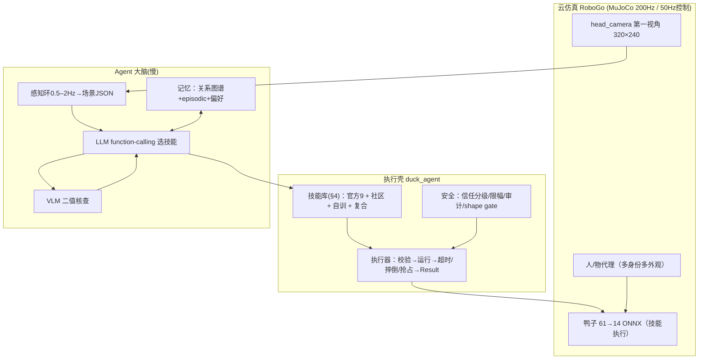

# DuckVLM-Harness：Agent × VLM × Harness 包装鸭子具身控制的完整方案（v1.1 · 2026-09-09）

> 本版更新：把“microduck 生态已有的开源模型与行为（走路/跑步/翻滚/滚轮/球类…）全部收编为可调技能”落成正式设计（§4 技能层扩充 + §11 附录技能清单），并新增“开源模型/行为 → 技能”的流水线与技能库成长路线。
> 一句话：做一个“执行壳（Harness）”，把鸭子已会/可获取/可自训的运动控制封装成技能工具；Agent（LLM+VLM）负责看懂场景、听懂指令、挑选技能、核查结果；50Hz 运动控制永不等待大模型。全部在 RoboGo 云仿真（MuJoCo）上可复现、可评测、可发布。

---

## 1. 背景与目标

### 1.1 我们有什么
- 无实体鸭/无 RDK 板；RoboGo DuckTogether 云端 5090（推荐 1 卡 dsp-24c192g）。
- 鸭子仿真栈：MuJoCo + EGL 第一视角（head_camera 320×240）+ ONNX 策略（61→14，50Hz）+ LocalSim/PolicyBank/LocalKick + duck_play（追球/L1 认人/组合叙事）。
- **开源技能池（本版盘点，都是可变成技能的“行为/模型”）**：
  - 官方 ONNX 9 个：alpha_walking / alpha_stand / alpha_sitstand / alpha_ground_pick / ball_kick_left / ball_kick_right / roulade / roller / roller_crouch（HF: pollen-robotics/microduck-policies）；
  - microduck_rl 注册任务 33 个（18 基础 + 15 backlash 变体）：走/rough 走、VelStand(走+摔倒恢复)、StandUp、SitStand、GroundPick、BallKick、Roulade、滚轮系(Velocity-Rollers/Swizzle/Crouch/Slope/StandUp/Spin)；
  - HF 社区长尾 ~28 仓库：running、flamingo-cycle、polite-bow、moonwalk-backward、stilts、swing、electric-slide、happy-hop、basketball、beak-throw、step-up(-head-brake)、rough-walk-e/g、collision-flamingo-ii、Datawhale 4096×6000 走路/踢球等（sim-only，行为以各 README 为准）；
  - 我们自己的：走路基线（4096×6000）、duck_play 行为控制器（追球/跟随/绕行/召唤/复合叙事）。

### 1.2 我们要什么
把以上技能池 + 感知 + Agent + Harness + 记忆，做成 **“会认人、懂指令、记得主人、守边界、还会表演”的家庭社交小管家鸭子**，交付为可复现全链路系统（代码+技能库+数据集+评测+视频）。

### 1.3 设计红线
1. VLM/LLM 永不阻塞 50Hz 控制环。
2. Harness 是唯一“能动鸭子”的入口（校验→限幅→摔倒处理→超时→审计）。
3. 无 API Key 可完整复现（脚本 pilot + 规则核查降级）。
4. 全开源；社区技能默认视为“未验证”，上鸭子前先过 Harness 的 shape gate 与沙盒试跑（呼应官方 policy channel 的社区策略安全机制）。

---

## 2. 相关研究 / 工程依据（浓缩）
- Harness 范式：Externalization in LLM Agents（2604.08224）；CaP（Liang 2023）；RHO（2606.16458）；Guava（2606.18363）；Zetta（2608.16590，闭环化）；Auto-Policy not Auto-Skill（2608.25091，安全策略与技能分离）；Contract-Grounded BT（2607.12220）；Ludi 0.1（2608.22035）。
- MCP/协议：IEEE LLM+MCP 机器人控制（2026）；SLM 规划+VLM grounding via MCP 类人控制（IEEE 2026）；rosaOS（ACL 2026）；mcp_robot；Anthropic 硬件 MCP/MHS（2026-08）。本期用 JSON function-calling，MCP 作为可选外包装。
- VLM/社交：ARIS（2605.00943）；HUMA（2607.10991）；IntentVLM（2604.24002）；LightNav-0（2608.30935，只借鉴“图上点选”，不做导航）；QuadFM（2603.24021，文本→情感动作）；Not Forgotten（2607.24190）。
- 中文工程：地平线 HoloAgent-0（Agent Harness 到物理世界）；RoboHarness（雷峰网 2026-08）。
- 微duck 生态：quackd（LLM→技能）；microduck-ai-world（VLM 环外 intent）；TinyVLA（VLA 路线）；microduck-mcp；官方 policy channel（M8：HF 技能一键安装/回滚）。

---

## 3. 总体架构（一图流）


---

## 4. 技能层设计（本版核心：把整个生态的“行为”都变成可调技能）

### 4.1 为什么“走路/跑步/翻滚…都能是技能”
技能的本质 = **一段有名字、有参数、有前置条件、有完成判据、可被 Harness 安全调用的运动行为**。它不关心底层是官方 ONNX、社区 ONNX、自训策略还是复合状态机——只要满足同一个 61→14 观测/动作契约 + manifest 契约，就能进技能库。这就是 microduck 官方“策略通道”的设计红利：**换个技能 = 换策略文件，不换鸭子身体**。

### 4.2 技能获取的四级来源（对应“技能从哪来”）
| 来源 | 内容 | 获取方式 | 可信度 |
|---|---|---|---|
| L0 官方 | 9 个官方 ONNX | HF 直接拉取 | 高（出厂验证） |
| L1 社区 HF | ~28 个社区策略/任务 | HF 拉取（sim-only，以 README 为准） | 中（需试跑） |
| L2 自训 | microduck_rl 33 个注册任务 | `uv run train <task> …` → export ONNX | 自己可控 |
| L3 原创 | 新任务（Proxemics RL、认人、多鸭…） | 扩展 microduck_rl 注册新 env | 我们的增量 |

### 4.3 技能本体分类（8 类）
移动 / 特技与恢复 / 球类 / 滚轮类 / 交互·社交 / 表达·表演 / 复合·叙事 / 服务型（感知辅助，如 look_at、scan）。

### 4.4 技能总表 v1.0（“已有行为 → 技能”的完整映射）
说明：kind=episodic（播完即停）/ perpetual（受命令驱动直到判据）/ composite（复合）。来源列中：官方=HF pollen-robotics/microduck-policies；社区=HF <owner>/<repo>（sim-only，行为以 README 为准）；自训=microduck_rl 任务（可 Flat/Rough/Backlash）。

| 类别 | 技能 | kind | 来源（策略/任务） | 关键参数/前置 | 完成判据（仿真可读） | 备注 |
|---|---|---|---|---|---|---|
| 移动 | walk(前/后/左/右/转) | perpetual | 官方 alpha_walking / 自训 Velocity-Flat(-Rough,-Backlash) | vx,vy,wz 限幅；upright | 计时/到位 | 走路=基础移动 |
| 移动 | run | perpetual | 社区 microduck-running / 自训 Velocity 高速度命令 | 高速命令；先 warm-up | 达速/计时 | 社区 66+ 下载 |
| 移动 | moonwalk(倒退舞步) | perpetual/episodic | 社区 fffiloni/microduck-moonwalk-backward | 低 vx | 计时 | 表达性移动 |
| 移动 | rough_walk | perpetual | 社区 rough-walk-e/g；自训 Rough 变体 | 需粗糙地形 | 计时/不摔 | 地形类 |
| 特技 | roulade(前滚翻) | episodic | 官方 roulade.onnx；自训 Roulade | 站姿、前方净空 | 1s 播完且 upright | 翻滚=你说的“翻滚” |
| 特技 | standup(摔倒站起) | perpetual | 自训 StandUp / VelStand；官方 alpha_stand 兜底 | fallen | 回 upright | 恢复技能，安全兜底 |
| 特技 | sitstand | episodic | 官方 alpha_sitstand；自训 SitStand | 站/坐态 | 姿态到位 | |
| 特技 | hop/jump | episodic | 社区 happy-hop、max-height-jump、jump playground | 站姿 | 离地/落地 upright | 社区跳类 |
| 特技 | stilts / swing / electric-slide / step-up(-head-brake) / collision-flamingo-ii | episodic | 社区 stilts/swing/electric-slide/step-up 系列 | 站姿、场地 | 播完且 upright | 社区技能，先试跑验证 |
| 特技 | backflip(后空翻) | episodic | 社区 microduck-backflip（mjlab 任务） | 站姿、净空 | 播完且 upright | 未上官方，风险高 |
| 球类 | kick_left / kick_right | episodic | 官方 ball_kick_left/right；自训 BallKick | 球在脚前 0.15–0.5m | 球速>0.5 或 0.6s | 踢球 |
| 球类 | chase_ball(追球) | perpetual | 我们 duck_play chase 控制器 + walk | 检测到球 | 到位/触球 | 复合/控制器技能 |
| 球类 | dribble/carry_ball(带球) | perpetual | 社区 Ball Follow/drag；自训 BallKick 扩展 | 球在可控位 | 带球位移 | 社区有 drag-the-ball |
| 球类 | beak_throw(嘴投) | episodic | 社区 q2p/microduck-beak-throw | 球在嘴前 | 球离嘴 | 社区技能 |
| 球类 | basketball | episodic | 社区 HannesVonEssen/microduck-basketball | 球/篮在场 | 按 README | 社区技能 |
| 滚轮 | roller_drive | perpetual | 官方 roller.onnx；自训 Velocity-Rollers | 装滚轮 | 计时 | 官方“第二大脑” |
| 滚轮 | roller_crouch / swizzle / slope / standup / spin | perpetual/episodic | 官方 roller_crouch；自训 Swizzle/RollerCrouch/Slope/StandUp/Spin | 滚轮态 | 各判据 | 滚轮表演系 |
| 交互·社交 | approach_person(id,dist) | perpetual | 我们 duck_play 控制器 + walk（可换未来 Proxemics RL） | 人在视野/身份已知 | 距离带±0.1m | 认人闭环 |
| 交互·社交 | follow_owner(dist) | perpetual | 我们 duck_play + 未来 Proxemics RL 自训 | owner 在场 | 带内保持 N 秒 | **自训研究点** |
| 交互·社交 | orbit_stranger(radius) | perpetual | 同上 | stranger 进近距 | 环绕≥θ/N 秒 | **自训研究点** |
| 交互·社交 | summon_approach | perpetual | 同上 | owner 召唤事件 | 到位并保持 | L1 已验 |
| 交互·社交 | ground_pick(叼物) | episodic | 官方 alpha_ground_pick；自训 GroundPick | 物在嘴前方地面 | 嘴尖触地 | 取物 |
| 交互·社交 | look_at(bearing,pitch) | perpetual | head 命令槽（61d 契约自带） | — | 头部到位 | 注视/服务型 |
| 交互·社交 | scan(扫视找人) | perpetual | head 命令组合 | — | 一圈完成 | 服务型 |
| 表达 | quack / coo / greet | episodic | sounds/语音合成（仿真模拟或播放） | — | 播放结束 | 鸭子音色 |
| 表达 | express(mood) | episodic/composite | 技能组合（转圈/低头/翘头）+ quack | mood∈{happy,sad,excited…} | 动作序列完成 | 文本→动作 v0 |
| 表达 | dance | episodic | 社区 sidekick-dance/Swan Lake 编舞；自训 | 场地 | 播完 upright | 舞蹈/表演 |
| 表达 | polite_bow / flamingo | episodic | 社区 polite-bow / flamingo-cycle | 站姿 | 播完 upright | 礼仪/平衡秀 |
| 复合·叙事 | deliver_ball_to(owner) | composite | 追球→带/踢→verify→表达 | owner 在场、有球 | 球-主距离下降且 delivered | 我们 M1 已做雏形 |
| 复合·叙事 | welcome_owner | composite | 认出→approach→greet→express | owner 进入 | 完成欢迎序列 | 认人叙事 |
| 复合·叙事 | guard_home(防陌生人) | composite | orbit/警戒 + 不响应陌生人指令 | stranger 在场 | 全程未跟陌生人 | 信任分级演示 |

> 注：表内“社区”技能上线前必须过 Harness 的 shape gate（obs/action 维度、manifest）并先沙盒试跑，避免把未验证模型直接当技能（呼应官方 policy channel 对社区策略的处理）。

### 4.5 从“开源模型/行为”到“技能”的流水线（一条命令上线）
```
① 获取策略
   官方:   hf 拉 alpha_walking.onnx 等
   社区:   hf 拉 <owner>/microduck-xxx（或 robotctl policy add 同款逻辑）
   自训:   uv run train Mjlab-Velocity-Flat-MicroDuck --env.scene.num-envs 4096 ...
           uv run scripts/export.py ... → output.onnx（烘焙归一化）
② 注册技能 = 在 manifest.py 加一条（schema 见 §4.6）
   校验: obs/action 维度=61/14、kind、duration、preconditions、trust
③ Harness 沙盒试跑（pilot 触发该技能 3~5 次）→ 通过后正式可被 Agent 调用
④ （可选）沉淀 trace → 复合技能/宏技能入库
```
- 官方技能：出厂即可信，直接入库。
- 社区技能：试跑通过才入“可用”，否则入“候选”区（Agent 看不到）。
- 自训/原创：按我们的评测门槛（成功率/摔倒率）决定是否入“可用”。

### 4.6 技能 manifest 示例（= Agent 的函数 schema = 可执行契约）
```json
{
  "name": "kick_toward",
  "description": "把面前的球朝某个水平角踢出。要求球在正前方0.15~0.5m。",
  "kind": "episodic",
  "policy": "ball_kick_left.onnx",
  "duration_s": 0.5,
  "preconditions": ["upright", "ball_in_front"],
  "params": {"bearing_deg": {"type": "number", "range": [-60, 60]}},
  "complete_when": "ball_speed > 0.5 or timeout",
  "trust": "owner|guest",
  "source": "official"
}
```

### 4.7 技能库成长路线（“走路/跑步/翻滚都是技能”之后的自然延伸）
1. 先把 L0 官方 9 + L1 社区重点（running/flamingo/bow/moonwalk/roulade 类）收编入库 → **技能库 v1**；
2. 需要但社区没有/不稳的（如稳定 run、backflip、jump、dance），用 microduck_rl 自训补位 → v1.5；
3. 我们原创的交互/社交技能（follow/orbit/summon Proxemics RL、认人、表达）→ v2，这是 Duck Together 的增量；
4. 技能库自动沉淀（trace→宏技能）只由 Harness 写库 + 安全审批（呼应 Auto-Policy 的批评）。

---

## 5. Harness 执行壳设计
- 唯一动作入口；调用前校验（参数/前置/信任分级）；执行中守护（摔倒→standup、超时、抢占）；执行后回报 Result(trace)；审计日志（谁/何时/调了什么）。
- 与 50Hz 关系：方案 A（本期）= 主循环同步执行技能，Agent 线程只投递“下一技能调用”；方案 B（预留）= Harness 服务化（unix socket/HTTP），将来 MCP 化接真机。
- 伪代码：见 v1.0 文档同款（Harness.call → SkillRegistry → Safety → Result）；本版新增 `shape_gate(policy)` 与 `sandbox_try(skill)` 用于社区技能上线。

---

## 6. 感知层设计（结构化场景 JSON = 世界接口）
- 管线：head-cam 帧 → 人检测(YOLO11n/先真值过渡) → SORT → ReID/VLM grounding（“红衣服的人”）→ VLM 属性/活动 QA → 场景 JSON（0.5–2Hz，异步）。
- 场景 JSON 含 duck 状态、persons(id/role/attrs/activity/bbox/rel)、objects(球等)、events（召唤手势等）。
- 几何量（bearing/range）尽量来自检测/真值/单目定位，VLM 不猜数字。

---

## 7. Agent 规划层设计
- 输入：系统提示（人格+安全红线+格式）+ 技能 manifest（§4.6）+ 场景 JSON + 记忆 + 用户指令/事件。
- 输出：function-calling 序列（approach→verify→kick→verify→done），Harness 逐条执行；verify 由 VLM 二值 QA；失败→重规划（≤N 次）→求助。
- 记忆/关系：关系图谱（id→familiarity/trust/preferences/stats）+ episodic（RAG）；行为随熟悉度变化，**信任分级写进 Safety 而非 prompt**。
- 表达层：express(mood) 表驱动 v0；完成后/被表扬/被摸有反馈动作。

---

## 8. 仿真落地：代码结构与里程碑
### 8.1 建议目录
```
duck_agent/
├── manifest.py        # 技能 manifest（§4.6），含 L0/L1/L2/L3 来源标记
├── skills/            # 每个技能一个文件（官方/社区=薄封装；复合=编排）
├── harness.py         # 执行壳
├── safety.py          # 信任分级/限幅/审计/shape gate
├── skill_loader.py    # 从 HF/本地 ONNX 拉取并注册（模拟 robotctl policy add）
├── perceive.py        # 感知环 → 场景 JSON
├── verifier.py        # VLM 二值 QA + 无 key 降级
├── planner.py         # function-calling 客户端
├── pilot.py           # 无模型降级
├── memory.py          # 关系图谱 + episodic RAG
├── express.py         # 表达层
└── launch/{demo_obey.py, bench.py, replay.py}
```

### 8.2 里程碑（每步可验收）
| 阶段 | 内容 | 验收 |
|---|---|---|
| W0 | 技能盘点与上线工具：skill_loader + manifest v1（官方 9 全入库；社区挑 6~8 个试跑） | `duck_agent/manifest.py` 列出技能；pilot 逐个触发不崩 |
| W1 | harness 骨架 + pilot：复合技能 deliver_ball_to | 无模型完成“走到主人→把球给他” |
| W2 | 感知环（检测/ReID→场景 JSON）；W3 VLM QA/grounding；W4 LLM 规划+记忆+表达+陌生人场景；W5 发布 | 各阶段指标见 §8.3 |
| 后续 | 自训缺口技能（run/backflip/jump/dance）→ 入库；Proxemics RL 社交技能；trace→宏技能；MCP 外包装 | 技能库成长且全部过安全审批 |

### 8.3 评测指标
- 任务成功率（送球/召唤/欢迎 10/10）；单步延迟（LLM≤3s、感知≤1s）；决策链可解释性抽检；
- 安全：个人空间违规 0、摔倒自动恢复、陌生人指令拒绝率 100%；
- 技能库质量：每个技能沙盒试跑通过率、社区技能 shape gate 拦截数；
- 舒适/表现：召唤响应时间、跟随带占比、表达触发正确率；记忆一致性抽查。

---

## 9. 概念澄清与 FAQ
- Harness=执行壳：把“能动的动作”包成受控工具的唯一入口；不是 AI，是工程护栏+接口层（Guava/RHO/Zetta/HoloAgent-0 同思路）。
- Hermes Agent / AutoSkills：2026 年“自进化技能壳”类系统；我们只借鉴“trace 沉淀技能”，但坚持 Harness 唯一写库权 + 安全审批。
- Skill vs Policy：Skill=“鸭子会做什么行为”；Policy=“安全允许什么动作发生”。安全写死在 Harness（Auto-Policy 观点），不进 prompt。
- 为什么走路/跑步/翻滚能是技能：它们都满足同一观测/动作契约，只需 manifest 登记 + Harness 封装；官方策略通道（M8）已把“换行为=换 ONNX”做成产品机制。
- 为什么不用 VLA 直接出动作：VLA 延迟/算力不适合 50Hz 双足；学界倾向“技能+Agent 编排”；我们已有 RL 技能，走工具调用最省最稳。
- 无 API Key 能跑：能（pilot+规则核查）；接本地 Qwen2.5-VL/Ollama 升为真 Agent。

---

## 10. 关键参考文献
- Harness：2604.08224（外化综述）；CaP(Liang 2023)；2606.16458(RHO)；2606.18363(Guava)；2608.16590(Zetta)；2608.25091(Auto-Policy)；2607.12220(Contract-Grounded BT)；2608.22035(Ludi)
- MCP×机器人：IEEE 2026 两篇；2608.21417；rosaOS(ACL2026)；mcp_robot(GitHub)；Anthropic MHS(2026-08)
- VLM/社交/表达：2605.00943(ARIS)；2607.10991(HUMA)；2604.24002(IntentVLM)；2608.30935(LightNav-0)；2603.24021(QuadFM)；2607.24190(Not Forgotten)
- 生态与中文工程：quackd；microduck-ai-world；TinyVLA；microduck-mcp；官方 microduck-policies；microduck_rl tasks 注册表；地平线 HoloAgent-0；RoboHarness(雷峰网)

---

## 11. 附录 A：技能清单快照（2026-09-09 实采）
- 官方（HF pollen-robotics/microduck-policies，9 ONNX）：alpha_walking / alpha_stand / alpha_sitstand / alpha_ground_pick / ball_kick_left / ball_kick_right / roulade / roller / roller_crouch。
- microduck_rl 注册任务（33=18 基础+15 backlash；`uv run list-envs` 可查）：Velocity(Flat/Rough)、VelStand(F/R)、StandUp(F/R)、SitStand(F/R)、GroundPick(F/R)、BallKick、Velocity-Rollers、Swizzle、RollerCrouch、RollerSlope、RollerStandUp、Spin、Roulade + 各自 -Backlash- 变体（RollerStandUp/Spin/Roulade/BallKick 部分无 backlash）。
- 社区 HF（示例，sim-only，以各 README 为准）：RemiFabre/microduck-flamingo-cycle；fffiloni/microduck-polite-bow-b1d864；fffiloni/microduck-moonwalk-backward-55e6af；HannesVonEssen/microduck-running；HannesVonEssen/microduck-stilts；HannesVonEssen/microduck-swing；HannesVonEssen/microduck-basketball；joanfox/microduck-happy-hop；q2p/microduck-beak-throw；Nupr-Haokun/microduck-step-up(-head-brake)；Histochemichael/microduck-electric-slide-policy；Teethyfish/microduck-collision-flamingo-ii；RemiFabre/microduck-rough-walk-e/g；Datawhale/Microduck-RL-4096x6000、Microduck-BallKick-4096x6000；pngwn/microduck-detector（感知类，非动作）。