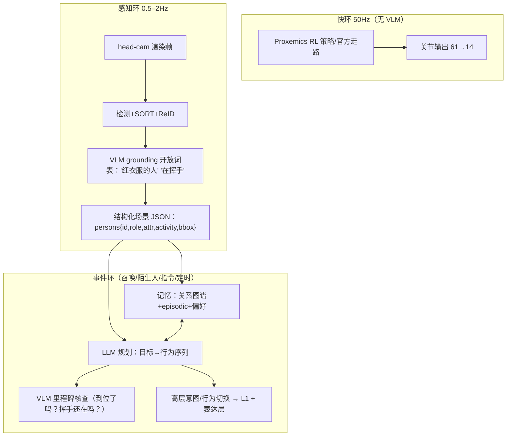

# 鸭子 × VLM Agent：前沿研究与适配设计（2026-09-09）

> 问题：如果走“Agent 方向”，用 VLM 做感知 + 语言控制，有什么前沿研究和设计适合鸭子？
> 范围：arXiv 2025–2026 检索 + 已读摘要；结合鸭子约束（纯仿真、50Hz 控制、云端 5090、无板、认人/社交定位）
> 一句话结论：不要走“VLA 直接出 50Hz 关节”这条（边缘端延迟与 sim 代价高、学界也正被批评）；**鸭子适合“慢 VLM 做感知/规划/记忆 + 快 RL 做运动 + 技能库做表达”的分层 Agent**——2026 年最相关的是 ARIS（关系知识图谱）、HUMA（条件式 VLM+RL）、IntentVLM（意图识别）、QuadFM（文本→情感动作），把它们“变小、变低视角、变成一只鸭子”就是你的创新位。

---

## 1. 前沿研究地图（按“对鸭子的用途”分组）

### 1.1 顶层范式（决定“怎么设计”，先看这两篇）
- **Weights or Skills?（2608.01851，2026-08 综述）**：机器人学习正分成两派——(a) 把能力烤进权重（VLA 冻结权重直接出动作）；(b) **Agent 自己写/挑可执行技能（code-as-policy）**，能无梯度自我改进。结论对鸭子很重要：**鸭子已经有“会走路/会踢/会坐”的 RL 技能，走 (b)“技能编排 + 语言规划”路线最省、最稳、最好解释**；不需要去训一个 VLA 大模型。
- **Embodiment Gap（2608.18433，2026-08）**：VLA 即使泛化好，也常因**延迟/算力/本体差异**上不了真机。→ 佐证：VLM 绝不能进 50Hz 控制环（microduck-ai-world 也这么设计：VLM 只在环外给 bounded intent）。

### 1.2 “关系 + 记忆 + 对话”的社交 Agent（你最该对标的 2026 新作）
- **ARIS（2605.00943，2026-05）**：社交机器人的 **Agentic + Relationship Intelligence** 框架，三大件：
  1) **Social World Model**：用知识图谱显式存“谁是谁、和我的关系、见过几次”（跨会话重识别）；
  2) **RAG 对话**：对话历史涨到几千轮仍保持有界延迟；
  3) 模块化架构用结构化 API 协调“语音/视觉/动作”，在 Pepper 上做真人实验（N=23），智能感/生命力/好感度显著高于纯 LLM。**开源承诺：发表后开源。**
  → 鸭子的“认主人+信任分级+记得习惯”= 一个极小的 ARIS Social World Model；ARIS 的轮式 Pepper 没有双足运动与低视角，这是我们的差。
- **Not Forgotten（2607.24190，2026-07）**：类人头 Kim 的**跨会话个性化 episodic 记忆**（LLM 记不住人）。记忆模块设计可直接参考。

### 1.3 人的“意图”理解（你的 L2 核心）
- **IntentVLM（2604.24002，2026-04）**：**开放词表意图识别**，两阶段“前向-逆向建模”：先由视频语言模型生成“目标候选”，再做结构化选择推理（降低幻觉）。IntentQA/Inst-IT 上 SOTA（~80%，超基线 30%，接近人类）。→ 适合鸭子“挥手=召唤、指方向=去那、坐下=想互动”这类开放意图，但它是研究级视频模型，鸭子只需在其思路上用轻量版本。
- **HUMA / Think When It Matters（2607.10991，2026-07）**：反应式 RL 管常规，**VLM 只在“人进入近距敏感区”等时刻被条件触发**；Social-MP3D/HM3D 上个人空间违规显著下降。→ “慢 VLM 只在关键时刻醒”的设计已被验证。
- **Lightweight Visual Reasoning for Socially-Aware Robots（2603.03942，2026-03）**：轻量视觉推理解释动态人类行为并决定回应——方向相同、强调轻量。

### 1.4 语言控制的动作/表达层（让鸭子“会表演”）
- **QuadFM（2603.24021，2026-03）**：首个大规模**文本→四足动作**数据集（11,784 条：走/互动/情绪表达如跳舞、伸懒腰；3 层标注含自然语言命令 35,352 条）；配套 Gen2Control RL 在 **Orin 边缘端**跑通“文本→动作”。→ 启示：可以给鸭子造一个**“文本→鸭子动作”小数据集**（用已有技能+头部动作组合：开心=转圈+摇头，委屈=低头），再做检索/生成。
- **LLM-Powered Action Synthesis from Speech/Gestures/Music（2606.31158，2026-06）**：LLM 融合语音+手势+音乐节拍→合成动作序列（ROS 四足）。→ 鸭子有 quack/喇叭/ToF theremin，天然能做“听到节拍跳舞/回应召唤”的多模态表达。
- **Expressive Gestures via RL+LLM（2606.18747）**、**SEAGR 问候调制（2607.16341）**、**Grounded Persona prompting（2608.26182）**：人格稳定性与问候/手势表达的可参考做法。

### 1.5 VLM 导航（社区已占，我们只做区分，不做重复）
- **LightNav-0（2608.30935，2026-08）**：把预训练 VLM 的空间智能“引导”成通用导航：**双通道 pointing（在图上点目标）**表达空间意图 + 残差 VQ 动作分词器 + 视觉历史压缩。→ 社区 DuckTogether V4 已把 LightNav-0 用到鸭子跨房导航。**我们的差异：不做“去哪”，做“跟谁/绕谁/懂谁”**；但“在图上点选人/物→转成方位”这个 pointing 接口值得借鉴给认人用。

### 1.6 需要避开的坑
- **ROBORMBENCH（2609.05401，2026-09）**：VLM 当 RL 奖励函数有“同义改写脆弱性”（同样轨迹换个说法奖励就变）→ 若用 VLM 打分要小心；**评测以确定性指标为主，VLM 只做二值里程碑核查（“他还在挥手吗？”）**。
- **AdaVLA（2608.29208）**、Embodiment Gap：VLA 边缘加速是热点但对我们非必需。

---

## 2. 适合鸭子的推荐设计：DuckVLM-HRI（慢 VLM × 快 RL × 技能表达）

### 2.1 设计原则（每条都有文献/生态支撑）
1. **VLM 永远不进 50Hz 环**（Embodiment Gap、microduck-ai-world 同款结论）。
2. **VLM 干三件慢活**：① 看图说话/指人（grounding：谁是主人/在干嘛）；② 听指令出计划 + 里程碑核查；③ 维护“社会记忆”（关系/偏好摘要）。
3. **RL/技能干两件快活**：50Hz 社交运动（Proxemics 策略，上一轮方案 B 层）+ 既有技能库（walk/kick/roulade/ground_pick/sitstand）当“手”。
4. **表达层**：文本→动作/情绪映射（QuadFM 思路的鸭子版），用 quack/头部动作/技能组合。
5. **感知不靠 VLM 单点**：0.5–2Hz 用轻量检测+ReID/跟踪（上一轮 A 层）给 VLM 提供“结构化摘要”，VLM 负责开放词表补盲（“那个戴帽子的人”“他在挥手吗”）——两者互补，也省钱。

### 2.2 架构（三环 + 记忆）

- **L1 快环**：你的 RL 社交策略或官方走路（人相对量进观测），永远不等 VLM。
- **L2 感知环**：结构化 JSON 是 VLM 与下游的唯一接口（可解释、可记录、可评测）。
- **L3 事件环**：仿 HUMA“只在关键时刻醒”+ ARIS 的“Social World Model”：关系图谱节点=人，边=熟悉度/信任级/见过次数/偏好；RAG 存 episodic 摘要（Not-Forgotten 式）。
- **表达层**：接 quack/头部/技能，做“开心转圈、委屈低头、被摸撒娇”等文本→动作映射（先检索表，再考虑 QuadFM 式生成）。

### 2.3 与现有生态的差异表（写帖/汇报用）
| 系统 | 做什么 | 我们没有/我们不同 |
|---|---|---|
| quackd | LLM 把“目标”拆成鸭子技能 | 无感知 grounding、无身份/关系、无记忆、无视觉核查 |
| microduck-ai-world | VLM 出 bounded intent + 语音 | 面向“找球/场地任务”，非“认人+信任” |
| TinyVLA | VLA 像素→动作（CPU） | 仍属 VLA 路线；我们走“慢 VLM+技能”路线（学界 Weights-or-Skills 倾向后者） |
| LightNav-0/社区 V4 | VLM 跨房导航 | 我们不做导航；借鉴其“图上点选”接口给认人 |
| ARIS | 关系图谱+RAG+模块化（Pepper） | 无低视角、无双足 RL 运动、非仿真开源于鸭子栈 |
| HUMA | RL+VLM 条件触发（轮式） | 无身份分级、无鸭子技能表达 |
| **DuckVLM-HRI（我们）** | **低视角认人 + 关系/信任 + 慢 VLM + 快 RL + 文本→鸭子表达，全仿真可复现** | —— |

---

## 3. 可落地的实现路径（在 RoboGo 云仿真里）

### M0 环境与基线
- 复用 duck_play：head-cam EGL 渲染 + LocalSim/PolicyBank；人代理升级（外观/动作/多人）。
- 决策：VLM 用**本地开源**（云端 5090 可跑 Qwen2.5-VL-7B/3B，避免 API 费用与出网依赖；确认 RoboGo 容器能否外呼 API 作为备选）。

### M1 VLM 感知（1–2 周）
- 每 0.5–1s 取一帧 → 轻量检测给 crops/bbox → VLM 问答模板：
  - “列出画面里的人：每个人 衣服颜色/性别/正在做什么/在画面位置” → JSON；
  - “谁是红衣的人？给 bbox”；“他是在挥手吗？”（二值核查）。
- 产出 `Microduck-DuckEgo-QA` 小评测集（鸭视角渲染图+问题+答案）来量化 VLM 在低视角下的表现（很可能比普通视角差——这就是你的数据/研究点）。

### M2 语言控制 + 技能编排（1–2 周）
- 自然语言 → LLM 规划为鸭子行为原语（follow_owner / orbit_stranger / approach / ground_pick / sit / quack / 表达动作…），动作由官方技能/RL 策略执行；
- 每一步执行后 VLM 二值核查（“到位了吗/他还在吗”），失败则重试或换行为（HUMA/闭环自修思路，Weights-or-Skills 里 code-as-policy 的 self-repair）；
- 输出“决策链文本”（看到谁→推断→做什么）供评审。

### M3 关系与记忆（1–2 周）
- 极简 Social World Model：SQLite/JSON 存人 ID↔熟悉度↔信任级↔常坐位置↔偏好；每次见面更新（ARIS 简化版）；
- episodic 记忆：事件摘要（时间/人/行为/结果）→ RAG 检索，跨会话“还记得你”；
- 行为参数随熟悉度变化（主人=贴身允许带 0.45m，访客=1.2m，陌生人=警戒绕行）。

### M4 表达层 + 全链路 Demo（1 周）
- 文本→鸭子动作检索表（开心=转圈+翘头，召唤回应=快速小跑+quack，委屈=低头）；
- 组合场景脚本：回家→认出主人→欢迎动作→主人说“去把球带给我”→VLM grounding 找球→踢传到主人→记忆更新→（陌生人进门→警戒绕行）。
- 评测：任务成功率 + VLM grounding 准确率 + 决策延迟 + 记忆一致性 + 视频。

### M5（可选研究线）
- 用 VLM 自动标注鸭视角合成图 → 蒸馏小检测/属性模型（上游 ideas 文档也推荐“大模型标注→小模型蒸馏”）；
- 训练“身份/关系”微调：把 VLM 输出结构化 JSON 的 3–5 轮对话数据收集成数据集（鸭视角社交 VQA），做 LoRA 微调 Qwen2.5-VL，让它在低视角更准（这是真正的模型训练卖点）。

---

## 4. 关键参考文献（arXiv 链接）
- Weights or Skills? 综述：arxiv.org/abs/2608.01851
- Embodiment Gap：arxiv.org/abs/2608.18433
- ARIS（关系智能，Pepper）：arxiv.org/abs/2605.00943
- Not Forgotten（episodic 记忆）：arxiv.org/abs/2607.24190
- IntentVLM（开放意图识别）：arxiv.org/abs/2604.24002
- HUMA（条件 VLM+RL）：arxiv.org/abs/2607.10991
- QuadFM（文本→四足情感动作）：arxiv.org/abs/2603.24021
- LightNav-0（VLM 导航，社区 V4 已用）：arxiv.org/abs/2608.30935
- LLM 动作合成（语音/手势/音乐）：arxiv.org/abs/2606.31158
- ROBORMBENCH（VLM 奖励的坑）：arxiv.org/abs/2609.05401

---

## 5. 一句话
**鸭子做 VLM Agent 的正确姿势不是“训练一个大 VLA 替它走路”，而是“慢 VLM 负责看人、听指令、记关系，快 RL 负责社交运动，技能库负责表达”——把 2026 年最热的 ARIS/HUMA/IntentVLM/QuadFM 各自最实用的那块，做成一只 25cm 低视角、全仿真可复现、全开源的“认人小管家”。**