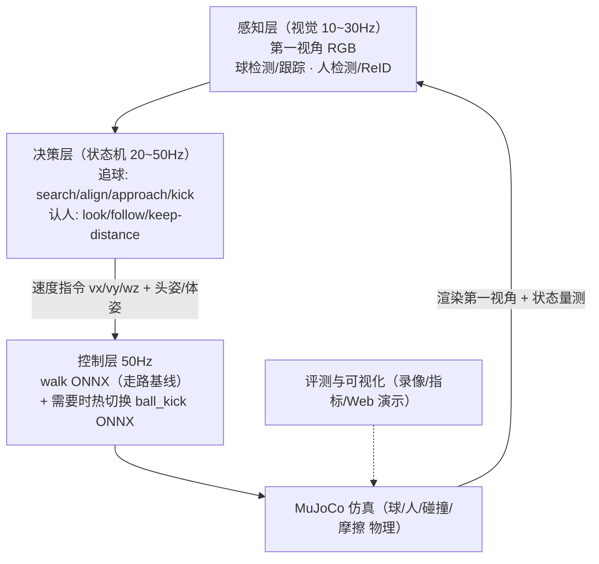

# MicroDuck 追球 / 认人 闭环技术方案（纯仿真 · RoboGo 云端 5090）

- 版本：v0.1（2026-09-08，与走路基线训练 ydx-walk-4096x6000 并行推进）
- 前提：无 RDK X5 / 无实体鸭；全部闭环在云端 MuJoCo 仿真内完成；走路基线 ONNX 作为低频底座
- 参考：Duck Together 35683（V3 追球连踢 3 次 / V4 LightNav 导航 / 3v3 足球）、35645（云+板架构）、microduck_rl 任务注册

---

## 1. 目标与定位

做两个“看得见、可验证、可发布”的闭环 Demo：

1. **追球**：鸭子自主发现球 → 走向/转向球 → 到脚边选择左右脚 → 踢球 →（球被踢飞后自然滚动）→ 再次追上同一颗球连续触球/射门；
2. **认人**：鸭子从第一视角认出“人”（再升级为认出“特定的人”）→ 注视、跟随、保持距离、被指定动作触发。

定位与社区差异点：
- 社区 V3 已用 **MuJoCo 真值 bbox** 打通“追同一颗球连踢 3 次”；我们的差异 = **把真值换成真实检测器（先 YOLO 系轻量模型在渲染图上的检测/跟踪）**，并把闭环做成可插拔模块；
- 认人（人检测→跟随→ReID 认特定人）在 Duck Together 里相对空白，是差异化主攻点。

## 2. 总体架构（分层，走路基线是底座）



分工：模型解决“怎么动”，感知+状态机解决“看什么、往哪动”。

## 3. 仿真环境与物理设计（回答：要不要加球和人的物理）

### 3.1 球 —— **要，且必须用真实物理**

| 项 | 结论 | 说明 |
|---|---|---|
| 需要物理吗 | **需要（核心）** | 追球闭环的价值就在“球会滚、会被踢飞、会因摩擦停下”，鸭子必须处理动态球 |
| 物理模型 | 复用 MuJoCo 现成球体 | 官方 BallKick 任务球参数：**直径 70mm、质量 15g**；接触摩擦、滚动、与脚/地面碰撞都由 MuJoCo 解算，不需要自己写 |
| 球速/滚动 | 由“踢的力量 + 地面摩擦 + 空气阻力(可忽略)”自然产生 | 不需要人为造“球速”参数；被踢后自然滚动到停（社区实测一脚最远 ~2.9m，自然滚停后重新追） |
| 域随机化 | 建议加 | 球半径/质量/摩擦系数在 ±20% 扰动；初始球位随机化，练鲁棒性 |
| 感知真值 | 先 `worldbody/ball` 的位姿直接投影出 bbox | 用于通闭环；**随后替换为“只从渲染 RGB 出发的检测器”**，否则不算真视觉闭环 |

设计要点：开局只放一次球，之后**不改球位姿/速度**（V3 已示范该规则），鸭子踢完要等球自然滚动再追——这是“追”和“原地踢”的本质区别。

### 3.2 人 —— **分三级，起步不需要完整人体物理**

| 级别 | 做法 | 用途 | 需要物理吗 |
|---|---|---|---|
| L1 运动学人形代理 | 用胶囊/椭球 + 头部组装的“假人”，沿脚本轨迹移动（走/停/转身），带**不同颜色上衣 + 名牌/脸纹理**区分身份 | 追人/跟随/认特定人（颜色/名牌=身份标签） | 不需要物理，轨迹 kinematic 即可；给一个胶囊碰撞体用于“不撞人” |
| L2 简单物理人 | 在 L1 基础上把代理放到 MuJoCo 自由体/关节体上，人-鸭有碰撞 | 距离保持、绕人转圈、人推鸭之类的交互实验 | 轻量物理（一个自由体 + 若干 geom）即可 |
| L3 拟真人/视觉真实 | 用 MuJoCo menagerie 的 humanoid，或导入带贴图的低模人形网格，第一视角渲染 | 训练/验证真实检测器（YOLO-person）与 ReID/人脸 | 主要为了**渲染真实感**，控制仍用脚本轨迹 |

关键结论：
- **第一步追人/认人不需要“人的走路物理”**——一个会走会停、颜色身份可区分的运动学代理就够了，成本低、指标可量化；
- 只有当你做“人-鸭物理互动”或“视觉 Sim2Real”时才升级到 L2/L3；
- 认人若走**视觉身份**路线，代理必须“看起来可区分”（不同衣服颜色/图案/身高），否则 ReID 无从学起。

### 3.3 相机与观测

- 鸭子头部已有 `head_camera` site，第一视角 RGB 由 MuJoCo EGL 渲染（云端已配 `MUJOCO_GL=egl`）；
- 通道：RGB(约 320×240~640×480) + 可选用真值深度；帧率 10~30Hz（不必 50Hz）；
- 内参可直接由 MuJoCo 相机模型给出，用于把检测 bbox 换算成水平/俯仰角（视觉伺服）。

## 4. 追球闭环设计

### 4.1 验收定义（可量化）
- 指标：单次追球成功触球率；**同一颗球连续触球 N 次**（N=3 作为 MVP 目标，参考 V3）；平均追球耗时；球位移（证明是“追动态球”不是原地踢）；射门命中率（加球门后）。
- 演示：第三人称录像 + 第一视角检测框叠加 + 遥测。

### 4.2 状态机
```
IDLE → SEARCH（转圈找球, 无球时头扫视）
     → ALIGN（球在视野 → 转向正对球, 边走边校正）
     → APPROACH（朝球逼近, 速度与距离成比例; 到踢球窗口减速站稳）
     → FOOT_SELECT（球相对身体在左/右 → 选左脚/右脚）
     → KICK（接管 ball_kick ONNX 0.5s; 13 维控制槽清零; 踢完回站稳）
     → RECOVER_STAND（回走路策略, 等球自然滚动）
     → 重新检测 → ALIGN（循环; 触球次数+1, 直到超时/达标）
```

### 4.3 感知管线（真值 → 真实检测器两阶段）
- 阶段 A（先通闭环）：MuJoCo 相机投影得到球 bbox（快、稳，用于调试状态机与策略切换）；
- 阶段 B（视觉闭环）：用轻量检测器（YOLOv8n / RT-DETR-nano 等）在渲染 RGB 上检测球；配套：
  - 渲染多样场景做**合成训练/验证集**（颜色/光照/纹理域随机化），**自动标注**（投影真值当标签，无需人工）；
  - 若检测器泛化不足 → 加入少量人工标注或换更大的预训练模型；
  - 球速估计：两帧 bbox 中心差 + 深度 → 简单卡尔曼预测，帮助“预判球滚向”。

### 4.4 控制接线（复用走路基线与 BallKick）
- 决策层输出 61 维观测里的命令槽：`twist(vx, vy, wz)` + 头姿 `head_pose`；身体/姿态命令置默认；
- 走路基线负责移动与平衡；到踢球窗口由状态机**热切换** `ball_kick_left/right.onnx`，0.5s 后切回；
- 频率：控制 50Hz；状态机 20~50Hz；感知 10~30Hz（与 35683 V4 经验一致：VLM 类高层 ~几 Hz，中层 MPC/状态机数十 Hz）。

### 4.5 与官方任务的关系
- 官方已有 `Mjlab-BallKick-Flat-MicroDuck`（球盲踢固定位球）和 velocity walking；**本方案不训练新踢球策略**，而是组装：走路(追)+官方踢球(触球瞬间)，先把闭环跑通；后续如需“带球绕桩”再训练新的策略任务。

## 5. 认人闭环设计

### 5.1 验收定义
- 人走进场景 → 鸭子转头注视并跟随，保持设定距离（如 0.8m），人不走就停；人走出视野→转头搜索；
- 认特定人：场景有 2 个“人”（不同颜色/名牌），指令“跟小红”→ 只跟红色代理（身份 ReID 正确率 ≥95%）。

### 5.2 感知
- 人检测：YOLO-person / 预训练人体检测（或先真值 bbox 通闭环）；
- 身份：L1 阶段用**颜色+名牌标签**（等价弱 ReID）；升级路线：上衣颜色直方图 → 轻量 ReID（OSNet 类）→ （后续 VLA/视觉大模型做 open-vocab 认人，如“跟穿红衣服的”）；
- 跟踪：ByteTrack/SORT 保持 ID 稳定。

### 5.3 决策与控制
- 由 bbox 中心偏移 → 水平角误差 → 转向速度 wz（P 控制）；bbox 高度/深度 → 距离误差 → vx（带死区，保持距离）；
- 头部注视：head_pose 命令对准人头位置；身体朝向跟随；
- 安全：设置 min 距离，过近自动后退（L2 有碰撞体时防穿透）。

### 5.4 认人 × 追球组合玩法
- “找到主人并带球靠近主人” = 认人 + 追球两个状态机级联（高价值 Demo）；
- “只有主人靠近才站起/互动”；“被主人推倒后自己起来并看向主人”。

## 6. 数据与训练策略（要不要数据集/仿真采集）

| 模块 | 是否需要数据 | 方案 |
|---|---|---|
| 走路/踢球（RL 控制） | 否 | 自博弈（已在训的 4096×6000） |
| 球/人检测器（监督） | 是（合成即可） | 渲染 RGB + 投影真值自动标注，域随机化；无人工 |
| ReID/认身份 | 是（合成即可） | 颜色/名牌先顶替；升级用开源 ReID 预训练 + 合成场景微调 |
| 高层策略/状态机 | 否 | 规则状态机（MVP）；后续可行为克隆 |
| VLA/Agent（π0.5） | 微调才需要 | 先零样本 VLM 指挥；微调再采示范轨迹 |

**结论：全程不需要“手工采集/标注真实数据”**；要采集也是用 MuJoCo 自动渲染自动标注，云端 5090 一晚上能生成上万张。

## 7. 衍生应用与功能矩阵（回答：能衍生成什么）

### 追球系
| 功能 | 说明 | 优先级 |
|---|---|---|
| 追球+连续触球 | MVP | P0 |
| 射门得分（加球门/门线判定） | 目标检测 + 球门几何 | P1 |
| 点球/带球绕桩 | 组合状态机，练带球 | P2 |
| 多鸭足球（2v2/3v3） | 角色分工：追球/接应/守门（V4 已开网页版） | P3（用 8 卡可做多实例） |
| 捡球/把球搬到指定点 | ground_pick + 追球 + 导航 | P2 |

### 认人系
| 功能 | 说明 | 优先级 |
|---|---|---|
| 注视 + 跟随 + 保持距离 | MVP | P0 |
| 认特定的人（ReID/颜色/名牌） | 身份区分 | P1 |
| 人走鸭随（陪伴/导盲玩具原型） | 跟随升级 | P1 |
| 手势/指向交互（招手→过来） | 加手势识别 | P2 |
| 避人（不撞人、绕行） | L2 碰撞体 + 避障 | P2 |

### 组合与 Agent 系（最终亮点）
| 功能 | 说明 | 优先级 |
|---|---|---|
| “找主人→带球给他”→完整叙事 Demo | 认人 × 追球 × 状态机 | P1 主打 |
| 自然语言指挥（VLM/π0.5）：“把球踢到红椅子旁” | 高导 VLM 出命令，中层执行 | P2 |
| 语音交互（ASR/TTS）+ 认人 + 动作 | 多模态 | P2 |
| 事件触发（人/球出现→动作） | 感知事件驱动 | P2 |

## 8. 云端工程落地（代码组织建议）

```
/root/microduck_sim/duck_play/            # 新模块目录（与官方 sim 隔离）
├── perception/    # 相机取流、真值bbox、YOLO检测、跟踪、ReID
├── behavior/      # 状态机：chase_ball.py / person_follow.py / composite.py
├── control/       # 命令生成、策略热切换封装（walk/kick 加载器）
├── sim/           # 场景脚本：加人代理、球随机化、评测回放
├── eval/          # 指标统计、录像(EGL)、报告
└── launch/        # 一键运行入口（后台 nohup 脚本）
```
- 与现有 `sim_server.py`(8080 驾驶舱) 的关系：先独立跑闭环 + 录视频；稳定后再以“视觉端”身份接入 WebSocket `/vision`（保留原协议），在网页演示“鸭子自己追球/找人”；
- 训练产物（checkpoint/ONNX/视频/日志）定期上传 HF `XenderYang/microduck-*`，代码发布 GitHub `YDxun/*`。

## 9. 里程碑（估算，单人 + 云端）

| 阶段 | 内容 | 估时 | 出口 |
|---|---|---|---|
| M0 | 走路基线收敛 + ONNX 导出 | 训练 ~2h（进行中）+0.5d | walk.onnx |
| M1 | 追球闭环 MVP（真值bbox） | 3~5 天 | 连踢 3 次视频 + 指标 |
| M2 | 换真实检测器（视觉闭环） | 3~5 天 | 检测器追球 Demo |
| M3 | 认人 MVP（代理+跟随+注视） | 3~5 天 | 跟随/注视视频 |
| M4 | 认特定人（颜色→ReID） | 3~5 天 | 认人 Demo |
| M5 | 组合叙事 Demo（找主人带球） | 3~5 天 | 完整演示（项目帖主材料） |
| M6 | （可选）VLA 指挥接入 | 1~2 周 | Agent Demo |

## 10. 风险与对策

| 风险 | 对策 |
|---|---|
| 走路基线不稳/收敛慢 | 先 2000 迭代看曲线，必要时调 reward/curriculum，断点续训 |
| 踢球策略“球盲”导致触球率低 | 先严格“对准+减速站稳+距离窗口”状态机，用 V3 经验参数起步 |
| 渲染图检测泛化差 | 域随机化渲染、合成集自动标注、必要时真值兜底并量化差距 |
| 认人身份与“真实人脸”差距 | 明确定义 MVP=颜色/名牌身份，ReID 作为升级项 |
| 云端时长/费用 | 训练/渲染集中在 5090；验收完关机；长任务 nohup+定时汇报 |
